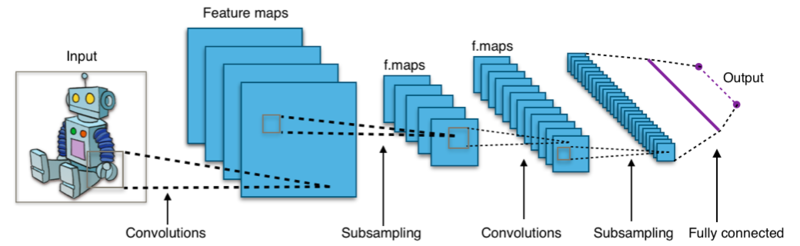
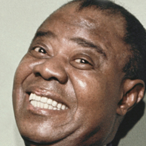

<!-- page_number: true -->
<!-- footer: Create your own neural network with Keras -->

Create your own neural network with Keras
===

##### [CSRG Talks](http://csrg.cl/event/talks2018)

###### Francisco Casas B. ( [@autopawn](https://github.com/autopawn) )

---
# Machine Learning

The objective of **machine learning** is to create algorithms that **learn**:

> "A computer program is said to learn from experience [...] if its performance at tasks in $T$, as measured by $P$, improves with experience $E$."
> -- Tom Mitchell (1997)

$T$ may be **classification**, **regression**, **clustering**, etc.
$E$ usually comes in the form of **data**.

---
# Artificial Neural Networks

* An **ANN** is a collection of connected units (artificial neurons).
* Each connection transmits a signal.
* An artificial neuron receives signals and processes them to signal additional artificial neurons.

They are usually useful for multivariate problems with strong correlations between the variables and with complex distributions.

---
# Artificial Neural Networks

A feed forward neural network:


---
# Artificial Neural Networks

Typical activation for a neuron:
$$
u_j = \sigma \left(\sum_i w_{ij} x_i+b_j \right)
$$
where $x_i$ are the activations from input neurons and $\sigma$ is the sigmoid activation function.


Weights $w_{ij}$ and biases $b_j$ are parameters to be trained.

---
# Artificial Neural Networks

* When we train an ANN we calibrate them to approximate an **unknown** function $X \rightarrow Y$.
* We take the input features $x_i$ and try to predict $y_i$ for each sample $i$.
* We minimize an error function like the **mean square error**:
  $$
  L = \sum_i (y_i-\hat{y}_i)^2
  $$
  where $\hat{y}_i$ is the network prediction for $x_i$.
  Mainstream learning algorithms use the gradient of this function to adjust the $w$'s and $b$'s as each $\hat{y}_i$ depends of them.

---
# Other kinds of ANNs

* Convolutional Neural Networks (CNNs).
* Generative Adversarial Networks (GANs).
* Recurrent networks (RNN, LSTM).
* [Many more](https://towardsdatascience.com/the-mostly-complete-chart-of-neural-networks-explained-3fb6f2367464).

---
# Our example problem

We will take images from the [UTKFace](https://susanqq.github.io/UTKFace/) dataset:


---
# Our example problem

We will use the automatically cropped face images:


---
# Our example problem

We will try to predict the **race** of a person from:
* The **photo**, which will be rescaled to 48x48 pixels

We may then expand our model to include the following inputs:
* The **age**
* The **gender**

For this purpose we will build **CNNs**!

---
# Inspecting the data


---
# Inspecting the data


---
# Preprocessing the data

```python
import os
import re

import numpy as np

from PIL import Image

# Get the file names:
DIR = './UTKFace'
fnames = list(os.listdir(DIR))

# Data arrays
x_img = []
x_age = []
x_gender = []
y_race = []
```

---
# Preprocessing the data
```python
# Regular expression to parse the parts of the name
regex = re.compile('(\d+)_(\d+)_(\d+)_.*\.jpg')

# Process each file:
for fname in fnames:
    match = regex.match(fname)
    if match:
        age,gender,race = match.groups()
    else:
        print("Bad match: \"%s\""%fname)
        continue
    x_age.append(int(age))
    x_gender.append(int(gender))
    y_race.append(int(race))
    # Read the image and scale it
    img = Image.open(os.path.join(DIR,fname))
    img = img.convert('RGB').resize((48,48))
    x_img.append(np.array(img,dtype='float')/255.0)
    # Notice the normalization here         ^^^^^^
```

---
# Preprocessing the data

#### Normalizing the data is important
* The **weight initializers** (that determinate the starting point of our optimization), assume input activations around 1.
* Depending on our **activations**, it may be very necessary to avoid learning problems.


If our initial activations are too **big** we may have a **saturated gradient**.


---
# Preprocessing the data
```python
np.save('x_img.npy',np.array(x_img,dtype='float'))
np.save('x_age.npy',np.array(x_age,dtype='int'))
np.save('x_gender.npy',np.array(x_gender,dtype='int'))
np.save('y_race.npy',np.array(y_race,dtype='int'))
```

### Output:
```bash
$ python3 preproc.py
Bad match: "61_1_20170109150557335.jpg.chip.jpg"
Bad match: "61_1_20170109142408075.jpg.chip.jpg"
Bad match: "39_1_20170116174525125.jpg.chip.jpg"
```
There were bad labeled samples too!

---
# Google Colaboratory

We will work on [Google Colaboratory](https://colab.research.google.com), it allows us to create collaborative **jupyter notebooks** and use remote **GPUs**.
It also has all the python packages we need, already installed.


---
# Google Colaboratory

We need to change the *runtime type* to one with **GPU** support


---
# Google Colaboratory


* [Link to the Colaboratory notebook](https://colab.research.google.com/drive/1d1WTMKGRbuF5F9rrFYSSkUUJ_i8kjmvH)

---
# Shuffle the data

```python
# Shuffle the data
indexes = np.arange(x_img.shape[0])
np.random.shuffle(indexes)
x_img    = x_img[indexes]
y_race   = y_race[indexes]
```

Shapes:
```c
x_img.shape	 (23705, 48, 48, 3)
y_race.shape	 (23705,)
```

---
# Separate the data

```python
# Separate data for testing
N_TEST = x_img.shape[0]//4 # 25% of data for testing
x_img_test  = x_img[:N_TEST]
x_img_trai  = x_img[N_TEST:]
y_race_test = y_race[:N_TEST]
y_race_trai = y_race[N_TEST:]
```

Shapes:
```c
x_img_trai.shape	 (17779, 48, 48, 3)
x_img_test.shape	 (5926, 48, 48, 3)
y_race_trai.shape	 (17779,)
y_race_test.shape	 (5926,)
```

---
# Convolutional Neural Networks

Networks that have **convolutional layers**:

* Train several filters that are multiplied over the image.
* Ideal for *images* or other data with *spacial locality* as they exploit **local connectivity**.



[Image source](https://en.wikipedia.org/wiki/File:Typical_cnn.png)

---
# Convolutional Layers

* Each filter receives $t^2 k$ values (where $t\times t$ is the kernel size and $k$ is the number of channels).
* The resulting tensor will have one channel for each filter.


[Image source](https://en.wikipedia.org/wiki/File:Conv_layer.png)

---
# Max pooling layers

* Generally used **after** convolutional layers.
* It reduces tensor dimensions.
* For each pool of size $t\times t$, it only takes the maximum values.


[Image source](https://computersciencewiki.org/index.php/File:MaxpoolSample2.png)

---
# Keras


Keras is a **high-level** open source neural networks API in **Python**.

Keras delegates low-level operations such as tensor products and convolutions to a specialized tensor manipulation library to do so.

The available **backend engines** are:

- **TensorFlow**
- **Theano**
- **CNTK**

---
# Creating a Keras Model

Keras provides two ways to create a model.
* If our model is simple, only composed of several layers in sequence, we can create an instance of **`Sequential`**.
* If our model is more complex, e.g. multiple inputs, we'll have to use the **functional API**.

---
# Keras documentation

For any question that we may have, we should use the [Keras documentation](https://keras.io/layers/core/).


---
# Building our model

```python
# Create a sequential model:
model = keras.models.Sequential()
# 1st convolutional layer:
model.add(keras.layers.Conv2D(
    input_shape=(48,48,3), # Notice input_shape!
    filters=24,
    kernel_size=(3,3),
    activation='relu'))
# Convolutional layer:
model.add(keras.layers.Conv2D(
    filters=24,
    kernel_size=(3,3),
    activation='relu'))
# Max pooling
model.add(keras.layers.MaxPooling2D(
    pool_size=(2,2)))
# ...
```

---

```python
# 2 more convolutional layers:
model.add(keras.layers.Conv2D(
    filters=48,
    kernel_size=(3,3),
    activation='relu'))
model.add(keras.layers.Conv2D(
    filters=48,
    kernel_size=(3,3),
    activation='relu'))
# Max pooling
model.add(keras.layers.MaxPooling2D(
    pool_size=(2,2)))
# Flatten the last image
model.add(keras.layers.Flatten())
# 3 dense layers:
for i in range(3):
  model.add(keras.layers.Dense(
      units=250,
      activation='relu'))
# Last layer
model.add(keras.layers.Dense(
    units=5,
    activation='softmax'))
```

---
# Building our model


---
# The batch dimension
* We must fit in memory a parallel version of the model for **each sample**!
* As this is often not possible, we take a subset of them.
* This is known as the **batch**.

The size of this dimension is the **batch size**. We have to choose it.

The **batch size** affects the training! 

---
# ReLU activations

* We used **ReLU** activations instead of **sigmoids**.
* They are often [better](https://stats.stackexchange.com/a/226927) for **deep** architectures, as long as we initialize the weights right.


[Image source](https://commons.wikimedia.org/wiki/File:Activation_rectified_linear.svg)

---
# Final dense layer (softmax activation)

* Our model will have with 5 **output neurons**.
* Each **neuron** will represent a probability for each class.
* Probabilities must be **normalized**.
* As we will measure the performance of the network by its **accuracy**, we only care about the **max**.

We use **softmax** as the last activation:
$$
\sigma(z)_i = \frac{e^{z_i}}{\sum_{j}e^{z_j}}
$$
> We can't just set the **maximum** to 1 and the **others** to 0, as we need it to be differentiable.

---
# Loss function

For our **Loss** function we could use:
* The **mean squared error** against a **one-hot** vector.
* The **cross entropy**: ideal for comparing **probability distributions**:
  $$
  L =-\sum_{i}p(y=i)\log(\sigma(z)_i)
  $$
  we make $p(y{=}i){=}1$ for the right class and $0$ for the others:
  $$
  L =-\log(\sigma(z)_y)
  $$

---
# Compiling our model

We have to choose an optimizer and our loss function:

```python
model = cnn_model()
model.compile(optimizer='sgd',
              loss='sparse_categorical_crossentropy',
              metrics=['accuracy'])
```
* **SGD** or Stochastic Gradient Descent, is just to use the Gradient Descent on the batch samples at a constant rate.
* We can pass a more customized [`Optimizer`](https://keras.io/optimizers/) if we want.
* We use `sparse_categorical_crossentropy` if our **targets** are encoded as an integer instead of an **one-hot** vectors.
* We also want to measure the `accuracy`.

---
# Training our model

```python
EPOCHS = 50
history = model.fit(x_img_trai,y_race_trai,
	validation_data=(x_img_test,y_race_test),
	epochs=EPOCHS,batch_size=128)
```
* The **epochs** are the times we will feed the whole training dataset.
* The **validation data** is used to measure the *validation* *loss* and *accuracy*.
* We also save the [`History`](https://keras.io/callbacks/#history) object in order to plot the this measures.

---
# Training our model


---
# Learning over epochs


---
# Saving and loading our model

```python
# Save model
model.save('/gdrive/My Drive/datasets/race_model.h5')
```

```python
# Load model
loaded_model = keras.models.load_model(
	'/gdrive/My Drive/datasets/race_model.h5')
```

---
# Overfitting

When the model **overadjust** to the samples instead of learning the real distribution.


Its like **memorizing** the training dataset.

---
# Predicting with our model

We will test the model on 4 images outside the dataset:

 
 

---
# How we may enhance our model

* Reduce overfitting using **regularizers** like **Dropout** or **Batch normalization**.
*  Using the right [**Kernel initializers**](https://keras.io/initializers/), e.g. `he_uniform` for `relu` activations.
* Test several architectures using **cross validation**.
* Using the [**Functional API**](https://keras.io/models/model/) to create multi-input model that also recieves the **age** and **gender** and **concatenate** them in the first dense layer.

---
# A more complex model: UMONNA


---
# A more complex model: UMONNA


---
# Artificial Neural Networks drawbacks

* They need a lot of **data**.
* Acceptable training and execution times usually require **GPU**.
* They are **black-boxes**, getting insight of how they solve the task from inspection is hard. *What are they learning?*
* As they have a lot of parameters, **overfitting** is an issue.

---
# Artificial Neural Networks drawbacks

A lot of ML problems can be solved using simpler strategies, e.g.:
- Decisions trees
- Less squares regression
- Principal component analysis
- $k$-nearest neighbors

---
# Recommended references

* [3Blue1Brown Deep learning](https://www.youtube.com/watch?v=aircAruvnKk) video series.
* The [Deep Learning](http://www.deeplearningbook.org/) book.
